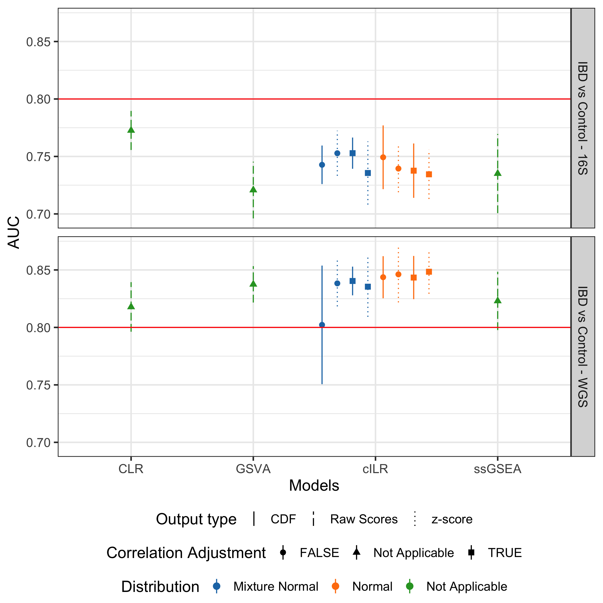
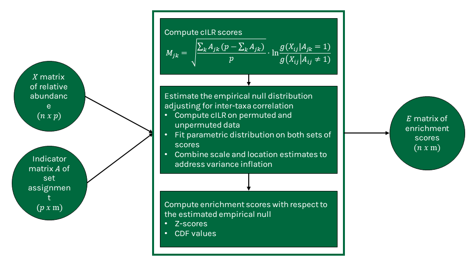

```{r setup, include=FALSE}
knitr::opts_chunk$set(results = 'asis',
                      echo = FALSE,
                      warning = FALSE,
                      tidy = FALSE,
                      message = FALSE,
                      fig.align = 'center',
                      out.width = "100%")
options(knitr.table.format = "html") 
#thematic::thematic_rmd(bg = "#00693e", font = "Karla")
library(tidyverse)
library(ggsci)
library(patchwork)
library(glue)
file.copy(from = glue("{dir}/figures/", dir = "../../cILR_analysis"), to = ".", recursive = TRUE, overwrite = TRUE)
```

## Introduction
- Microbiome data is sparse, compositional, and high-dimensional, which makes it difficult to apply standard statistical techniques. Set-based aggregation from the genomics literature is a well-defined approach to alleviate some of these issues.  
- Standard practice performs aggregation through abundance summation, but using summation doesn't allow for comparison of enrichment across sets of different sizes.  
- Here we developed a microbiome specific set-based aggregation method generating enrichment scores at the sample level. We address the compositionality of microbiome data by using the isometric log ratio transformation. Our score is equivalent to a competitive null hypothesis by defining enrichment as a comparison between taxa inside the set and its complement. 

## Acknowledgements    
This research is supported by funding from the National Institutes of Health (grants NLM R01LM012723, NIGMS P20GM104416, NLM K01LM012426 NIH UG3 OD023275, NIEHS P01ES022832 and EPA RD-83544201).

## Results  

### Sample-level significance testing 

```{r figure1, fig.align = "left", fig.width = 7, fig.height = 6, fig.cap = "Type I error rate **(A)**, and power **(B)** across different parametric simulation scenarios. Confidence bounds were obtained using Agresti-Couli approach. False-positive rate **(C)** and true positive rate **(D)** evaluation of similar methods on real 16S rRNA data from the oral microbiome of the gingival site. For **(A)** and **(B)**, enrichment of a specified set was tested at the sample level using cILR and the Wilcoxon rank sum test at $\\alpha$ of 0.05. For **(C)** and **(D)**, the set of aerobic microbes was tested for enrichment in all samples and was identified as correctly enriched if a significant $p$-value was obtained in supragingival samples."}


```

### Predictive models  

```{r figure2, fig.align = "left", fig.width = 5, fig.height = 3, fig.cap = "Classification performance of a naive random forest model using cILR scores as inputs compared against existing methods in gene set testing literature and the standard centered-log ratio transformation approach. The learning task involves predicting patients with inflammatory bowel disease (including Crohn's disease and ulcerative colitis) versus controls. Data sets used span both 16S rRNA sequencing (Gevers et al.) and whole genome shotgun sequencing (Nielsen et al.)"}



```

### Differential abundance analysis  

```{r figure3, fig.align = "left", fig.width = 6, fig.height = 4, fig.cap = "Differential abundance analysis using corncob, DESeq2 and cILR with either Wilcoxon rank sum test or Welch's t-test. Panel \\textbf{(A)} shows type I error results as the proportion of significant genera after 500 iterations where case/control status was assigned randomly to each sample. Panel \\textbf{(B)} shows true positive rate results as the proportion of significant genera who are either obligate anaerobes or aerobes. Both evaluations use 16S rRNA gene sequencing data from HMP. Type I error evaluation used stool samples while the true positive rate evaluation used samples from the gingival site."}

```

## Methods
```{r}

```